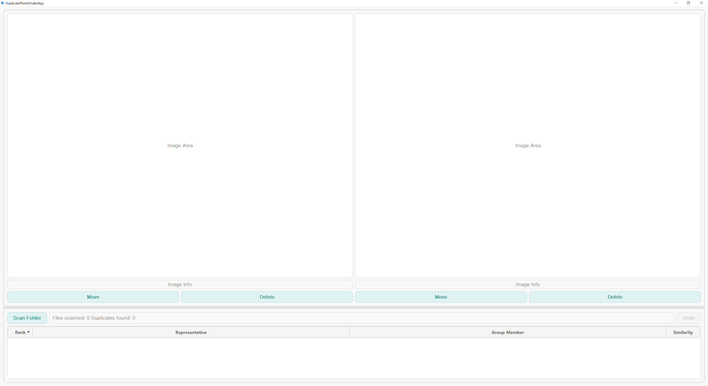

# DuplicatePhotoFinderPAAK 🗄️✨

Find and manage duplicate photos easily! This tool uses perceptual hashing to find visually similar images, including RAW and TGA formats. 🧐

## Quick Links 🔗

- [⬇️ Download Latest Release](https://github.com/htpaak/DuplicatePhotoFinderPAAK/releases/latest)
- [⭐ GitHub Repository](https://github.com/htpaak/DuplicatePhotoFinderPAAK)
- [💬 Feedback & Discussions](https://github.com/htpaak/DuplicatePhotoFinderPAAK/discussions)

## Key Features 🌟

*   **Visually Similar Detection:** Finds duplicate images based on content using perceptual hashing, not just file names or sizes.
*   **Folder Scanning:** Recursively scans the selected folder to find all potential duplicates.
*   **Format Support:** Supports common image formats (JPG, PNG, BMP, GIF) as well as RAW and TGA formats.
*   **Side-by-Side Preview:** Clearly shows the original and duplicate image pairs for easy comparison.
*   **Similarity Ranking:** Lists duplicate pairs ranked by visual similarity percentage.
*   **Flexible Management:** Allows deleting selected images (to Recycle Bin) or moving them to a chosen folder.
*   **Undo Action:** Provides an undo function for the last delete or move operation.
*   **Simple GUI:** Offers an intuitive graphical interface built with PyQt5.
*   **Standalone Executable:** Distributed as a single `.exe` file for Windows, no installation required.

## Demo 📸

## System Requirements 💻

*   **Operating System:** Windows (tested on Windows 10/11)
*   *(For End Users)* No special requirements other than Windows OS.
*   *(For Developers)* Python 3.x, PyQt5, Pillow, imagehash, rawpy, numpy

## Installation 🚀

1. Download the latest release from the [Releases Page](https://github.com/htpaak/DuplicatePhotoFinderPAAK/releases/latest).
2. Download the `DuplicatePhotoFinderPAAK_vX.Y.Z.exe` file (where X.Y.Z is the version number).
3. That's it! No installation needed. Simply run the downloaded `.exe` file.

## How to Use / Usage 📖🧭

1.  Launch the `DuplicatePhotoFinderPAAK.exe` file.
2.  Click the **Scan Folder** button.
3.  Select the folder you want to scan for duplicate images.
4.  Wait for the scanning process to complete. The status bar will show progress.
5.  Once finished, the table will populate with pairs of duplicate images, ranked by similarity.
6.  Click on any row in the table to see the preview of the original (left) and duplicate (right) images in the panels above.
7.  Below each image preview, you can find:
    *   **Delete Button:** Sends the displayed image to the Recycle Bin.
    *   **Move Button:** Allows you to move the displayed image to another folder of your choice.
8.  Use the **Undo** button to revert the last delete or move action if needed.

## Development Information 👨‍💻

*   **Language:** Python 3
*   **GUI Framework:** PyQt5
*   **Core Libraries:**
    *   `imagehash`: For perceptual image hashing and similarity comparison.
    *   `Pillow`: For opening and manipulating standard image formats.
    *   `rawpy`: For processing RAW image files.
    *   `numpy`: Required by `rawpy` and potentially `imagehash`.
*   **Packaging:** PyInstaller (using `build.bat` script for Windows builds).

## Acknowledgments 🙏

*   Thanks to all the potential contributors who might help with development in the future! 💖
*   Special thanks to the creators and maintainers of the amazing open-source libraries used in this project: PyQt5, Pillow, imagehash, rawpy, numpy! FOSS rocks! 🤘