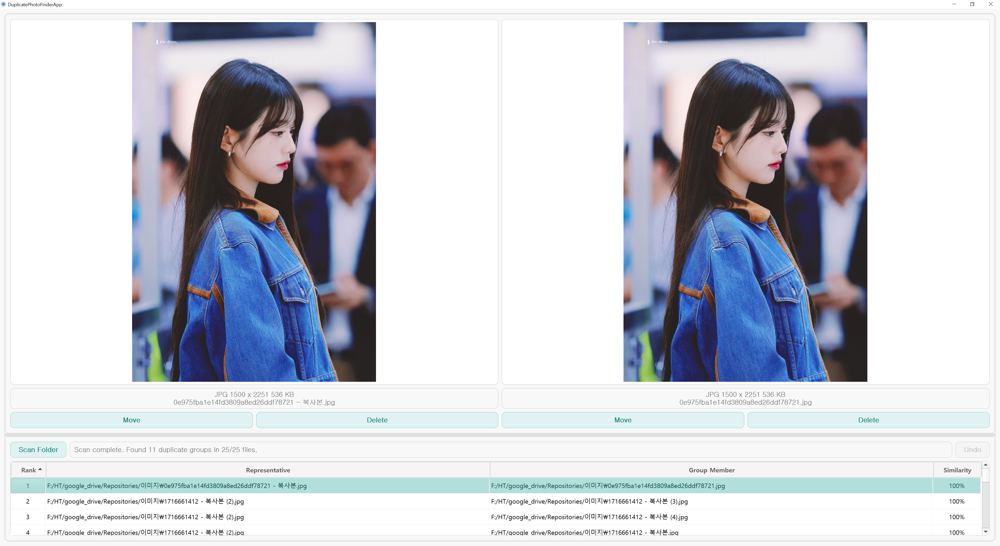

# DuplicatePhotoFinderPAAK 🗄️✨

Brief one-line description of your application/tool. Add an emoji if you want to give it more personality. 😄

## Quick Links 🔗

- [⬇️ Download Latest Release](https://github.com/htpaak/DuplicatePhotoFinderPAAK/releases/latest)
- [⭐ GitHub Repository](https://github.com/htpaak/DuplicatePhotoFinderPAAK)
- [💬 Feedback & Discussions](https://github.com/htpaak/DuplicatePhotoFinderPAAK/discussions)

## Key Features 🌟

## Demo 📸

## System Requirements 💻

## Installation 🚀

1. Download the latest release from the [Releases Page](https://github.com/htpaak/DuplicatePhotoFinderPAAK/releases/latest)
2. Download the `DuplicatePhotoFinderPAAK_vX.Y.Z.exe` file (where X.Y.Z is the version number).
3. That's it! No installation needed. Simply run the downloaded `.exe` file.
4. Launch DuplicatePhotoFinderPAAK and and enjoy! 🎉

## How to Use 📖

## Usage 🧭

## Development Information 👨‍💻

## Acknowledgments 🙏

*   Thanks to all the potential contributors who might help with development in the future! 💖
*   Special thanks to the amazing open-source libraries that make this project possible! FOSS rocks! 🤘